# INF.CommApp.DATA - Data Model Overview

**High-level overview of the healthcare communication system data model with visual relationships.**

## 🎯 Purpose
This document provides a **conceptual overview** of how data entities relate in the INF.CommApp healthcare communication system, with **Facility as the central hub**.

## 📊 System Architecture
The data model supports a healthcare communication platform where:
- **Facilities** house residents and coordinate care
- **Notifications** flow from resident needs to staff responses  
- **Users/Staff** provide care and receive alerts
- **Agencies** optionally employ healthcare professionals

## 🗂️ Data Models Reference
**Namespace:** `INF.CommApp.DATA.Models`
- ✅ `Facility.cs` - Care facilities (PRIMARY ENTITY)
- ✅ `Resident.cs` - Patients/clients receiving care  
- ✅ `User.cs` - Healthcare staff and professionals **[ENHANCED WITH AUTHENTICATION]**
- ✅ `Role.cs` - Role-based access control **[NEW - v2.0]**
- ✅ `UserRole.cs` - User-Role assignments **[NEW - v2.0]**
- ✅ `Notification.cs` - Alerts and messages
- ✅ `NotificationSubscription.cs` - User alert subscriptions
- ✅ `UserNotificationPreference.cs` - User notification settings **[NEW - v2.0]**
- ✅ `UserResident.cs` - Care assignment junction table
- ✅ `Agency.cs` - Healthcare agencies (optional)
- ✅ `AppDbContext.cs` - Entity Framework configuration

## 📅 Last Updated
- **Date**: October 25, 2025
- **Version**: 2.0 (Authentication System Integration)
- **Migration**: `AddAuthenticationTables` (20251026023014)
- **Auto-sync with C# models:** This document reflects the current state of the actual data model classes.

## 🔑 External ID Pattern
All main entities include both an internal `Id` (integer) and an `ExternalId` (GUID):
- **Internal operations**: Use `Id` for database relationships and EF Core navigation
- **External APIs**: Use `ExternalId` for all client-facing operations and API endpoints
- **Security benefit**: Prevents ID enumeration attacks and obscures internal database structure

```mermaid
graph LR
    %% FACILITY - STARTING POINT (Furthest Left)
    Facility[🏥 Facility<br/>Care Facility]
    
    %% Core Related Entities
    Resident[👥 Resident<br/>Patient/Client]
    User[👨‍⚕️ User<br/>Healthcare Staff]
    Notification[📢 Notification<br/>Alert/Message]
    
    %% Optional/Secondary Entity
    Agency[🏢 Agency<br/>Healthcare Agency]
    
    %% Primary Facility Relationships - Left to Right Flow
    Facility ==> Resident
    Facility ==> User
    
    %% Notification Flow: Created FOR Residents, SENT TO Users
    Resident ==> Notification
    Notification ==> User
    
    %% Care Relationship (Back to residents)
    User -.-> Resident
    
    %% Minimal Agency Connection (Least Important) - From top/bottom
    Agency -.-> User
    
    %% Styling - Facility as Main Focus
    classDef facilityFocus fill:#4caf50,stroke:#1b5e20,stroke-width:4px,font-size:16px
    classDef primaryEntities fill:#2196f3,stroke:#0d47a1,stroke-width:3px
    classDef secondaryEntities fill:#ff9800,stroke:#e65100,stroke-width:2px
    classDef minimalEntity fill:#e0e0e0,stroke:#757575,stroke-width:1px
    
    class Facility facilityFocus
    class Resident,User primaryEntities
    class Notification secondaryEntities
    class Agency minimalEntity
```



## Entity Descriptions

## 🎨 Visual Flow (Left to Right)

The diagram shows the logical flow of relationships in the healthcare communication system:

### **🏥 Facility** (Furthest Left - Green)
- **Primary hub** of the system
- Houses residents and coordinates care
- Generates facility-wide communications

### **👥 Resident & 👨‍⚕️ User** (Center - Blue) 
- **Residents** receive care and generate care needs
- **Users/Staff** provide healthcare services
- Both are directly connected to the facility

### **📢 Notification** (Flow - Orange)
- Created **FOR** residents (incidents, health updates, care needs)
- Sent **TO** staff who need to respond
- Bridges resident needs with staff actions

### **🏢 Agency** (Optional - Gray)
- **Minimal importance** in daily operations
- Some staff may be employed by external agencies
- Weakest visual connection (dotted line)

## 🔄 Data Flow Summary

1. **Facility** houses **Residents** and employs **Staff**
2. **Residents** generate **Notifications** (care needs, incidents)
3. **Notifications** are delivered to **Staff** for response
4. **Staff** provide care back to **Residents**
5. **Agency** optionally employs some **Staff** (external contractors)

## 💡 Key Design Principles

- **Facility-Centric**: Everything revolves around the care facility
- **Simple Flow**: Clear left-to-right progression
- **Visual Hierarchy**: Color coding shows importance levels
- **Clean Interface**: No technical details - just conceptual relationships

---

# Technical Implementation Details

## Entity Classes

### Core Entities (INF.CommApp.DATA.Models namespace)

#### 🏥 **Facility.cs** - Care Facilities
```csharp
public class Facility
{
    public int Id { get; set; }
    public Guid ExternalId { get; set; } = Guid.NewGuid();
    public string Name { get; set; }
    public string Address { get; set; }
    public string City { get; set; }
    public string State { get; set; }
    public string Zip { get; set; }
    public ICollection<Resident> Residents { get; set; }
}
```

#### 👥 **Resident.cs** - Patients/Clients
```csharp
public class Resident
{
    public int Id { get; set; }
    public Guid ExternalId { get; set; } = Guid.NewGuid();
    public string FirstName { get; set; }
    public string LastName { get; set; }
    public int FacilityId { get; set; }
    public Facility Facility { get; set; }
    public ICollection<UserResident> UserResidents { get; set; }
}
```

#### 👨‍⚕️ **User.cs** - Healthcare Staff
```csharp
public class User
{
    public int Id { get; set; }
    public Guid ExternalId { get; set; } = Guid.NewGuid();
    public string UserName { get; set; }
    public string Type { get; set; } // nurse, caregiver, doctor, etc.
    public int? AgencyId { get; set; }
    public Agency Agency { get; set; }
    public ICollection<UserResident> UserResidents { get; set; }
    public ICollection<NotificationSubscription> NotificationSubscriptions { get; set; }
}
```

#### 📢 **Notification.cs** - Alerts & Messages
```csharp
public class Notification
{
    public int Id { get; set; }
    public Guid ExternalId { get; set; } = Guid.NewGuid();
    public string Message { get; set; }
    public NotificationPriority Priority { get; set; }
    public DateTime CreatedAt { get; set; }
    public int FacilityId { get; set; }
    public Facility Facility { get; set; }
    public ICollection<NotificationSubscription> NotificationSubscriptions { get; set; }
}

public enum NotificationPriority
{
    General, Incident, High, Medium, Low
}
```

### Junction Tables (Many-to-Many Relationships)

#### 🔗 **UserResident.cs** - Care Assignments
```csharp
public class UserResident
{
    public int UserId { get; set; }
    public User User { get; set; }
    public int ResidentId { get; set; }
    public Resident Resident { get; set; }
}
```

#### 📬 **NotificationSubscription.cs** - Alert Subscriptions
```csharp
public class NotificationSubscription
{
    public int Id { get; set; }
    public int UserId { get; set; }
    public User User { get; set; }
    public int NotificationId { get; set; }
    public Notification Notification { get; set; }
}
```

### Optional Entities

#### 🏢 **Agency.cs** - Healthcare Agencies
```csharp
public class Agency
{
    public int Id { get; set; }
    public Guid ExternalId { get; set; } = Guid.NewGuid();
    public string Name { get; set; }
    public string Address { get; set; }
    public string City { get; set; }
    public string State { get; set; }
    public string Zip { get; set; }
    public ICollection<User> Users { get; set; }
}
```

## Database Context

The `AppDbContext.cs` configures all entities and relationships:

```csharp
public class AppDbContext : DbContext
{
    public DbSet<Facility> Facilities { get; set; }
    public DbSet<Resident> Residents { get; set; }
    public DbSet<User> Users { get; set; }
    public DbSet<Agency> Agencies { get; set; }
    public DbSet<UserResident> UserResidents { get; set; }
    public DbSet<Notification> Notifications { get; set; }
    public DbSet<NotificationSubscription> NotificationSubscriptions { get; set; }

    protected override void OnModelCreating(ModelBuilder modelBuilder)
    {
        modelBuilder.Entity<UserResident>()
            .HasKey(ur => new { ur.UserId, ur.ResidentId });
    }
}
```

## Technical Relationships

1. **🏥 Facility → 👥 Resident**: One-to-Many (Facility houses residents)
2. **🏥 Facility → 📢 Notification**: One-to-Many (Facility generates notifications)
3. **👨‍⚕️ User ↔ 👥 Resident**: Many-to-Many via `UserResident` (Staff assigned to residents)
4. **👨‍⚕️ User ↔ 📢 Notification**: Many-to-Many via `NotificationSubscription` (Staff subscribe to alerts)
5. **🏢 Agency → 👨‍⚕️ User**: One-to-Many (Optional - Agency employs users)

## Usage in Other Projects

- **INF.CommApp.API**: References this project for API controllers
- **INF.CommApp.BLL**: References this project for business logic
- **INF.CommApp.Web**: References this project for web application data access