# INF.CommApp.DATA - Data Access Layer

This project contains the Entity Framework Core data models, DbContext, and database migrations for the INF.CommApp healthcare communication application.

## Data Model Overview

This diagram shows the relationships between the data entities in the system:

```mermaid
graph LR
    %% FACILITY - STARTING POINT (Furthest Left)
    Facility[🏥 Facility<br/>Care Facility]
    
    %% Core Related Entities
    Resident[👥 Resident<br/>Patient/Client]
    User[👨‍⚕️ User<br/>Healthcare Staff]
    Notification[📢 Notification<br/>Alert/Message]
    NotificationSubscription[📬 NotificationSubscription<br/>User Alert Link]
    UserResident[🔗 UserResident<br/>Care Assignment]
    
    %% Optional/Secondary Entity
    Agency[🏢 Agency<br/>Healthcare Agency]
    
    %% Primary Facility Relationships - Left to Right Flow
    Facility ==> Resident
    Facility ==> User
    Facility ==> Notification
    
    %% Many-to-Many Relationships via Junction Tables
    User -.-> UserResident
    Resident -.-> UserResident
    User -.-> NotificationSubscription
    Notification -.-> NotificationSubscription
    
    %% Optional Agency Connection
    Agency -.-> User
    
    %% Styling - Facility as Main Focus
    classDef facilityFocus fill:#4caf50,stroke:#1b5e20,stroke-width:4px,font-size:14px
    classDef primaryEntities fill:#2196f3,stroke:#0d47a1,stroke-width:3px
    classDef junctionTables fill:#ff9800,stroke:#e65100,stroke-width:2px
    classDef minimalEntity fill:#e0e0e0,stroke:#757575,stroke-width:1px
    
    class Facility facilityFocus
    class Resident,User,Notification primaryEntities
    class UserResident,NotificationSubscription junctionTables
    class Agency minimalEntity
```



## Entity Classes

### Core Entities (INF.CommApp.DATA.Models namespace)

#### 🏥 **Facility.cs** - Care Facilities
```csharp
public class Facility
{
    public int Id { get; set; }
    public string Name { get; set; }
    public string Address { get; set; }
    public string City { get; set; }
    public string State { get; set; }
    public string Zip { get; set; }
    public ICollection<Resident> Residents { get; set; }
}
```

#### 👥 **Resident.cs** - Patients/Clients
```csharp
public class Resident
{
    public int Id { get; set; }
    public string FirstName { get; set; }
    public string LastName { get; set; }
    public int FacilityId { get; set; }
    public Facility Facility { get; set; }
    public ICollection<UserResident> UserResidents { get; set; }
}
```

#### 👨‍⚕️ **User.cs** - Healthcare Staff
```csharp
public class User
{
    public int Id { get; set; }
    public string UserName { get; set; }
    public string Type { get; set; } // nurse, caregiver, doctor, etc.
    public int? AgencyId { get; set; }
    public Agency Agency { get; set; }
    public ICollection<UserResident> UserResidents { get; set; }
    public ICollection<NotificationSubscription> NotificationSubscriptions { get; set; }
}
```

#### 📢 **Notification.cs** - Alerts & Messages
```csharp
public class Notification
{
    public int Id { get; set; }
    public string Message { get; set; }
    public NotificationPriority Priority { get; set; }
    public DateTime CreatedAt { get; set; }
    public int FacilityId { get; set; }
    public Facility Facility { get; set; }
    public ICollection<NotificationSubscription> NotificationSubscriptions { get; set; }
}

public enum NotificationPriority
{
    General, Incident, High, Medium, Low
}
```

### Junction Tables (Many-to-Many Relationships)

#### 🔗 **UserResident.cs** - Care Assignments
```csharp
public class UserResident
{
    public int UserId { get; set; }
    public User User { get; set; }
    public int ResidentId { get; set; }
    public Resident Resident { get; set; }
}
```

#### 📬 **NotificationSubscription.cs** - Alert Subscriptions
```csharp
public class NotificationSubscription
{
    public int Id { get; set; }
    public int UserId { get; set; }
    public User User { get; set; }
    public int NotificationId { get; set; }
    public Notification Notification { get; set; }
}
```

### Optional Entities

#### 🏢 **Agency.cs** - Healthcare Agencies
```csharp
public class Agency
{
    public int Id { get; set; }
    public string Name { get; set; }
    public string Address { get; set; }
    public string City { get; set; }
    public string State { get; set; }
    public string Zip { get; set; }
    public ICollection<User> Users { get; set; }
}
```

## Database Context

The `AppDbContext.cs` configures all entities and relationships:

```csharp
public class AppDbContext : DbContext
{
    public DbSet<Facility> Facilities { get; set; }
    public DbSet<Resident> Residents { get; set; }
    public DbSet<User> Users { get; set; }
    public DbSet<Agency> Agencies { get; set; }
    public DbSet<UserResident> UserResidents { get; set; }
    public DbSet<Notification> Notifications { get; set; }
    public DbSet<NotificationSubscription> NotificationSubscriptions { get; set; }

    protected override void OnModelCreating(ModelBuilder modelBuilder)
    {
        modelBuilder.Entity<UserResident>()
            .HasKey(ur => new { ur.UserId, ur.ResidentId });
    }
}
```

## Key Relationships

1. **🏥 Facility → 👥 Resident**: One-to-Many (Facility houses residents)
2. **🏥 Facility → 📢 Notification**: One-to-Many (Facility generates notifications)
3. **👨‍⚕️ User ↔ 👥 Resident**: Many-to-Many via `UserResident` (Staff assigned to residents)
4. **👨‍⚕️ User ↔ 📢 Notification**: Many-to-Many via `NotificationSubscription` (Staff subscribe to alerts)
5. **🏢 Agency → 👨‍⚕️ User**: One-to-Many (Optional - Agency employs users)

## Usage in Other Projects

- **INF.CommApp.Api**: References this project for API controllers
- **INF.CommApp.BLL**: References this project for business logic
- **INF.CommApp.Web**: References this project for web application data access